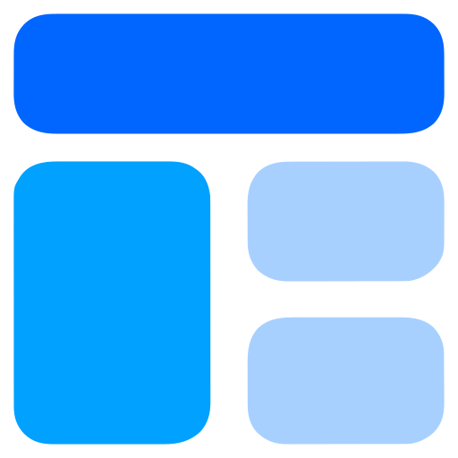
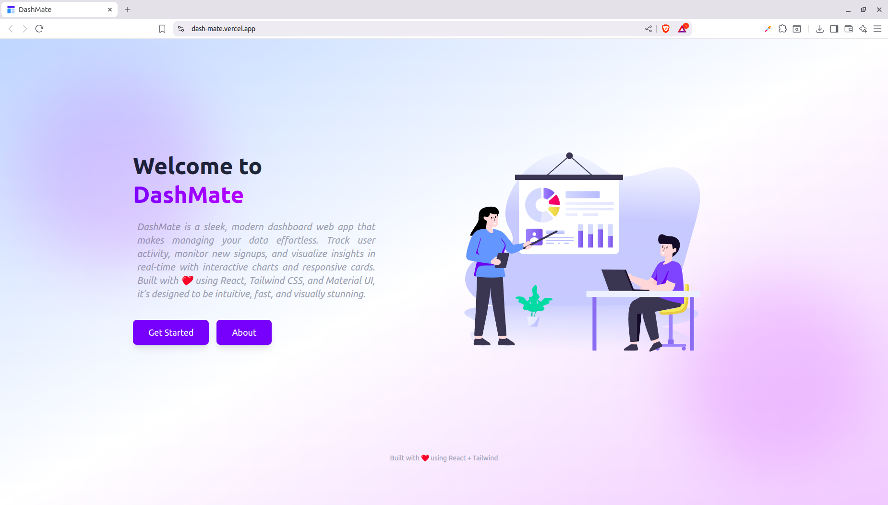
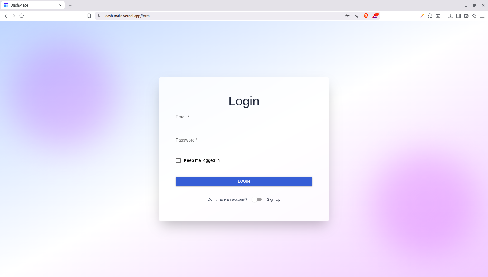
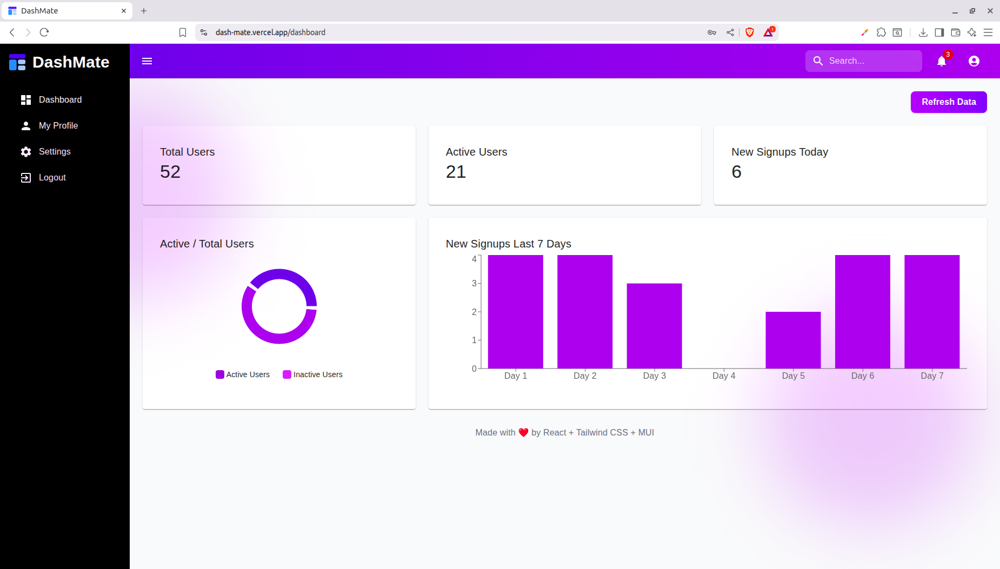
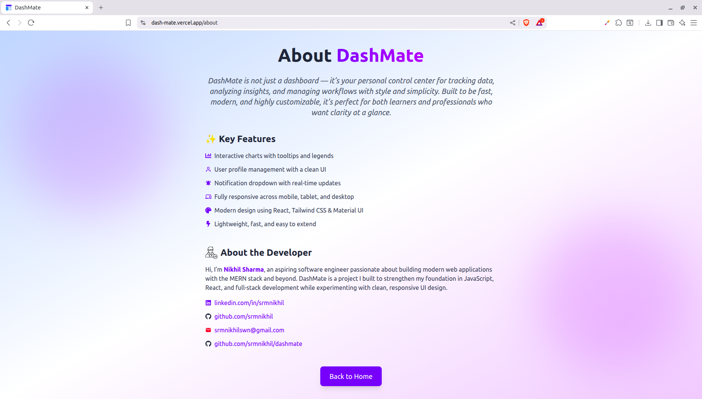

#  DashMate

<p align="center">
  <a href="https://react.dev/"></a>
  <a href="https://tailwindcss.com/"></a>
  <a href="https://mui.com/"></a>
  <a href="https://vitejs.dev/"></a>
  <a href="https://recharts.org/"></a>
</p>

A modern, responsive dashboard web app built with **React, Tailwind CSS, and Material-UI (MUI)**.  
DashMate provides an elegant way to track, visualize, and manage data with real-time insights, interactive charts, and a sleek UI.  

---

## ✨ Features  

- 📊 **Interactive Charts** – Visualize user activity with tooltips, legends, and responsive designs.  
- 🧑‍🎨 **User Profiles** – Manage and view user details in a clean, organized interface.  
- 🔔 **Notification Dropdown** – Get instant access to alerts and updates.  
- 📱 **Fully Responsive** – Optimized for mobile, tablet, and desktop.  
- 🎨 **Modern Tech Stack** – Built with React, Tailwind CSS, and Material UI for a stylish and flexible design.  
- ⚡ **Fast & Lightweight** – Simple setup, smooth navigation, and extendable components.  
- 🔄 **API Integration** – Fetch live data (e.g., from JSONPlaceholder) to populate charts and stats.  

---

## 📝 Usage

1. **Access the Dashboard**  
   - Navigate to the **Home Page** and click **Get Started** to enter the dashboard.  

2. **View User Stats**  
   - Check **Total Users**, **Active Users**, and **New Signups** displayed as cards.  
   - Hover over or click the **charts** to see detailed insights.  

3. **Interact with Charts**  
   - **Pie Chart**: Visualizes Active vs Inactive users.  
   - **Bar Chart**: Shows new signups over the last 7 days.  
   - Charts update dynamically when you click the **Refresh Data** button.  

4. **Manage Your Profile**  
   - Click **My Profile** in the sidebar or top menu to view and edit your user information.  

5. **Navigation**  
   - Use the **sidebar** or top **navigation icons** to move between pages: Dashboard, Profile, Settings, and Logout.  
   - The **search bar** and **notifications dropdown** provide quick access to important info.  

6. **Responsive Design**  
   - DashMate works seamlessly across **mobile, tablet, and desktop** screens.  

7. **Extend or Customize**  
   - Add new components, charts, or features by updating the React components in the `src/components` folder.  
   - Fetch live data from APIs or mock services like JSONPlaceholder for testing purposes.  

---

## 🌐 Demo  

👉 [Live Demo on Vercel](https://dash-mate.vercel.app)  

---

## 📸 Screenshots  

[](https://dash-mate.vercel.app) [](https://dash-mate.vercel.app/login) [](https://dash-mate.vercel.app/dashboard) [](https://dash-mate.vercel.app/about)

---

## ⚙️ Installation

1. Clone the repository:

```bash
git clone https://github.com/srmnikhil/dashmate.git
```

2. Install Dependencies:
```bash
npm install
```

3. Start the development server:
```bash
npm run dev
# or
npm start
```


## 🛠️ Technologies Used
- **React** - Frontend library for building the UI.
- **Tailwind CSS** - Utility-first CSS for styling.
- **Material-UI (MUI)** - Components for inputs and progress bars.
- **React Router** - Navigation between pages.

## 👨‍💻 About the Developer
- **Nikhil Sharma** - Full Stack Developer (MERN Stack)
- [LinkedIn](https://linkedin.com/in/srmnikhil)
- [GitHub](https://github.com/srmnikhil)
- Email: srmnikhilswn@gmail.com

## 📜 License
- This project is **open-source** and free to use for personal or commercial purposes.

---
